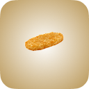
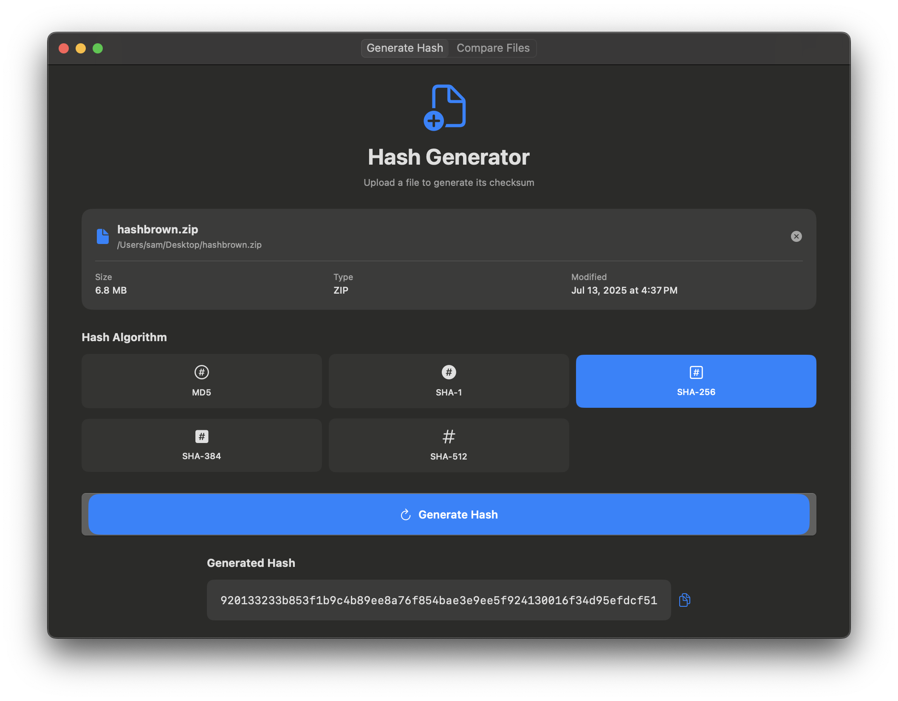
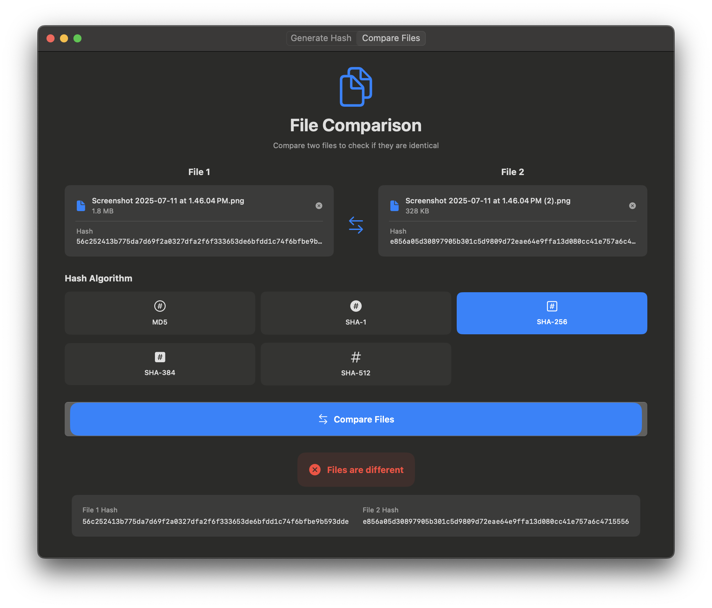

# hashbrown

**A modern, native macOS app for generating and comparing file hashes.**



## Features

- **Generate Hashes:**  
  Quickly compute MD5, SHA-1, SHA-256, SHA-384, or SHA-512 checksums for any file.
- **Compare Files:**  
  Select or drag-and-drop two files to check if their hashes match, using your chosen algorithm.
- **Modern macOS UI:**  
  - Drag-and-drop file selection  
  - Scrollable, auto-sizing interface  
  - Custom app icon and branding  
  - Dark mode support
- **Privacy-first:**  
  All hashing is performed locally on your Mac. No files ever leave your device.

## Screenshots



## Installation

### Download

- Download the latest `.dmg` from the [Releases](https://github.com/sjacksonhodum/hashbrown/releases) page (or use the `hashbrown_final.dmg` in this repo).
- Open the DMG and drag **hashbrown** to your Applications folder.

### Build from Source

1. **Requirements:**  
   - macOS 13+  
   - Xcode 15+
2. **Clone the repository:**
   ```sh
   git clone https://github.com/sjacksonhodum/hashbrown/
   cd hashbrown
   ```
3. **Open in Xcode:**  
   Double-click `hashbrown.xcodeproj`.
4. **Build & Run:**  
   Select the `hashbrown` scheme and build for "My Mac".

## Usage

- **Generate Hash:**  
  1. Go to the "Generate Hash" tab.  
  2. Drag a file or click to select one.  
  3. Choose a hash algorithm.  
  4. Click "Generate Hash" and copy the result if needed.

- **Compare Files:**  
  1. Go to the "Compare Files" tab.  
  2. Drag or select two files.  
  3. Choose a hash algorithm.  
  4. Click "Compare Files" to see if they match.

## Development

- **SwiftUI** and **CryptoKit** for native performance and security.
- **Sandboxed:**  
  The app uses macOS sandboxing and only requests read access to user-selected files.

## Testing

- Basic UI and unit test stubs are included (`hashbrownTests`, `hashbrownUITests`).  
  To run tests:  
  - Open the project in Xcode  
  - Select `Product > Test` or press `Cmd-U`

## Customization

- **App Icon:**  
  Custom icons are included in `Assets.xcassets/AppIcon.appiconset`.
- **DMG Installer:**  
  A prebuilt DMG is provided. For custom DMG backgrounds or layouts, see the project history for scripts and instructions.
 
